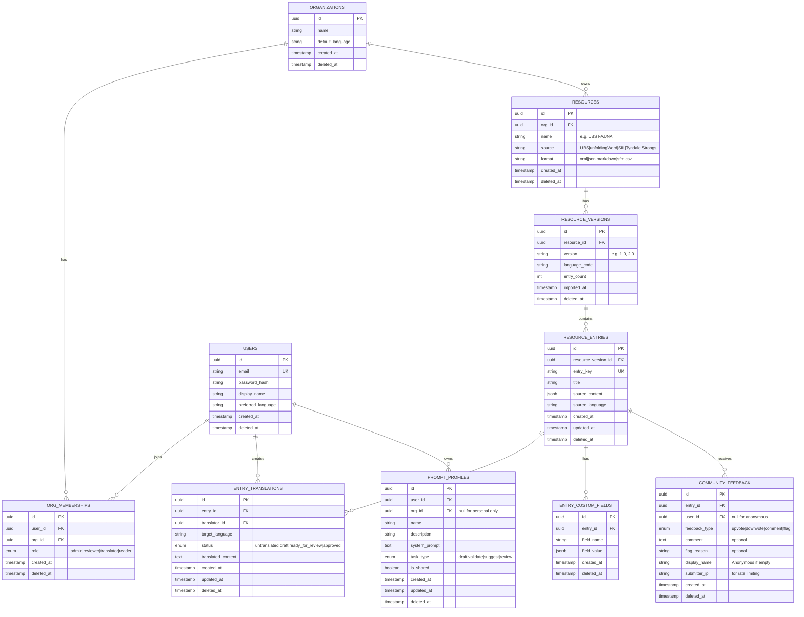

# PRD-001 — Resource Browser MVP

| Field | Value |
|---|---|
| **Status** | Draft |
| **Author** | Team |
| **Created** | 2026-04-18 |
| **Phase** | 1 |
| **Build steps covered** | 1 (DB schema) · 2 (UBS XML importer) · 3 (Browser UI) |
| **North-star metric** | Median time to validated export |

---

## 1. Problem Statement

Communities across the world wants high quality, reliable Bible-related resources (dictionaries, lexicons, commentaries) in their languages. However for someone who wanted to create such resources takes a lot of time and effort and they currently have no structured tooling for:

- Discovering reliable source resources
- Discovering what entries exist across multiple source resources
- Seeing which entries have been translated, are in draft, or are untranslated
- Navigating to the right entry quickly on a mobile device in low-bandwidth environments

Without a purpose-built browser, translators waste time identifying scope and cannot make data-driven decisions about where to focus effort. This is the first blocker on the path to a validated export.

---

## 2. Goals

1. **Discovery**: Any user (authenticated or public Reader) can browse all imported resource entries across UBS FAUNA, FLORA, and REALIA dictionaries.
2. **Search**: Users can find an entry by key, title, Bible reference, or content snippet in under 3 seconds on a mid-range mobile device.
3. **Status visibility**: Users can see at a glance which entries are untranslated, draft, ready for review, or approved.
4. **Navigation foundation**: The browser is the launch point into the translator workbench (PRD-002); every entry links to its workbench view.
5. **Round-trip integrity**: All imported entries can be exported back to source XML and pass canonical structural equivalence validation.

---

## 3. Non-Goals (Out of Scope for This PRD)

- Editing or translating entries (PRD-002 — Translator Workbench)
- AI-assisted drafting (PRD-003 — AI Draft Pipeline)
- Validation pipeline (PRD-004)
- Export engine (PRD-005)
- Community feedback (PRD-007)
- Resources other than UBS FAUNA, FLORA, REALIA
- Offline / PWA support

---

## 4. User Personas

### Primary: Translator (authenticated)
A missionary or language specialist who needs to find entries to work on. Likely on a mobile device, possibly with intermittent connectivity. Needs to quickly identify untranslated or draft entries and open them in the workbench.

### Secondary: Reviewer (authenticated)
A senior translator or project lead who monitors translation progress. Uses status filters to find entries pending review across resources.

### Tertiary: Admin (authenticated)
Sets up resources and manages org membership. Uses the browser to verify an import was successful.

### Quaternary: Reader (no authentication required)
A community member who can browse and view entries but not edit. Sees the same browser UI as Translator but without workbench entry links.

Reader can optionally submit entry ratings and feedback with an optional display name. Anonymous submissions are allowed only with CAPTCHA verification.

---

## 5. User Stories

### US-001 — Browse entry list
**As a** Translator,  
**I want to** see a paginated list of all entries across imported resources,  
**So that** I can understand the scope of work.

**Acceptance criteria:**
- Entry list loads on first visit within 2 seconds on a 4G connection
- Each entry card shows: entry key, title, resource badge, match type badge, translation status, last updated date
- List is paginated (50 entries per page) with infinite scroll or "load more"
- Default sort: resource priority, then stable alphabetical title

---

### US-002 — Filter by translation status
**As a** Translator,  
**I want to** filter entries by translation status (untranslated / draft / ready for review / approved),  
**So that** I can focus on the entries that need my attention.

**Acceptance criteria:**
- Status filter is visible on both mobile (drawer) and desktop (sidebar)
- Default state: all statuses shown
- `Needs Work` quick chip = untranslated + draft combined
- Status filter state is reflected in URL query params (e.g., `?status=untranslated,draft`)
- Filter applies within the current search scope and selected target language

---

### US-003 — Search for an entry
**As a** Translator,  
**I want to** type a query and see matching entries immediately,  
**So that** I can jump directly to the entry I need.

**Acceptance criteria:**
- Single unified search box — no mode toggle
- Search covers: entry key, title, indexed source content snippets, Bible references
- Bible references matched in human-readable (`John 3:16`), USFM notation (`JHN 3:16`), and mnemonic numeric (`04400301600005`) forms
- Results debounced (300ms) — no search triggered on every keystroke
- Results ranked: exact key → exact title → prefix title → exact ref → content snippet → resource priority → alpha title
- Each result card shows the match field type (key / title / content / reference) as a badge
- Empty state shows: "No entries match your search. Clear filters (primary) · Switch scope (secondary)"
- **Future expansion (Phase 2+)**: Bible references in vernacular languages (e.g., local language scripture reference format). For Phase 1, only store and match human-readable, USFM notation, and mnemonic numeric forms.

---

### US-004 — Scope search to specific resources
**As a** Translator,  
**I want to** limit my search to one or more specific resources,  
**So that** results are not cluttered with entries from resources I'm not working on.

**Acceptance criteria:**
- Scope chips always visible: `All` · `Selected Resources` · `Current Resource`
- Selecting `Selected Resources` opens a resource picker drawer
- Drawer allows multi-select of resource versions (e.g., `UBS FAUNA v1.0`, `UBS FLORA v1.0`)
- Active scope is reflected in URL query params (e.g., `?scope=selected&resources=fauna-v1,flora-v1`)
- Search runs only against selected resources when `Selected Resources` is active

---

### US-005 — View entry detail
**As a** Translator,  
**I want to** tap an entry and see its full source content and existing translations,  
**So that** I can assess what work has been done.

**Acceptance criteria:**
- On mobile: entry detail opens full-screen with a Back button to return to the list
- On tablet/desktop: entry detail opens in a side panel (master-detail layout)
- Detail view shows:
  - Entry key and title
  - Resource name and version
  - Source language text (read-only, full content)
  - All available translations (by language code, with translator name and date)
  - Translation status per language
  - Bible references (human-readable form)
  - Last updated date
- If user is authenticated as Translator/Reviewer/Admin: "Open in Workbench" button visible
- If user is a public Reader (not signed in): button not shown
- Reader feedback actions (upvote/downvote/comment/flag) visible and accessible on all breakpoints (mobile, tablet, desktop)
- On mobile: feedback actions displayed below entry detail content or in an expandable feedback panel

---

### US-006 — Select target language
**As a** Translator,  
**I want to** set my target language once and have it persist across sessions,  
**So that** I always see translation status relative to the language I'm working in.

**Acceptance criteria:**
- Target language resolved in order: user preference → org default → project fallback (`ml`)
- Language selector visible in browser header
- Selection persisted to user preference in database
- Cache keys include target language (status counts re-fetched on language change)

---

### US-007 — Preserve browser state
**As a** Translator,  
**I want to** return to the browser after opening an entry and find my filters and scroll position intact,  
**So that** I don't lose my place when navigating between the list and detail view.

**Acceptance criteria:**
- Browser back navigation restores: search query, scope, status filter, selected language, sort order, scroll position, selected entry
- State reflected in URL so it can be bookmarked and shared
- No full page reload on back navigation (client-side routing)

---

### US-008 — Import UBS XML resources
**As an** Admin,  
**I want to** import the UBS FAUNA, FLORA, and REALIA XML source files,  
**So that** entries are available for translators to browse.

**Acceptance criteria:**
- Import script processes all three XML files without errors
- All entries inserted into `resource_entries` table with correct resource version FK
- Protected content (Bible references, structural metadata) preserved as-is
- Import produces a round-trip validation report: import → export → XML diff
- Validation passes canonical structural equivalence for all entries
- Script is idempotent (re-running does not create duplicate entries; uses upsert)
- Entry count per resource logged to console on completion

---

### US-009 — Data integrity: round-trip validation
**As an** Admin,  
**I want to** verify that an export of the imported data matches the source XML,  
**So that** we have proof the importer did not corrupt or lose any content.

**Acceptance criteria:**
- Round-trip validation script: parse source XML → serialize back to XML → diff against original
- Diff is canonical structural (attribute order-independent, whitespace-normalized)
- All three dictionaries (FAUNA, FLORA, REALIA) must pass with zero structural differences
- Any failure produces a human-readable diff report pointing to the specific entry and field
- Script exits with non-zero code on failure (blocks CI)

---

### US-010 — Public reader ratings and feedback
**As a** Reader (not signed in),  
**I want to** rate an entry and submit feedback with an optional name,  
**So that** I can contribute quality signals without creating an account.

**Acceptance criteria:**
- Entry detail view includes reader feedback actions: upvote, downvote, comment, and flag
- Reader may submit feedback without authentication
- Reader name is optional; if omitted, submission is stored as `Anonymous`
- CAPTCHA challenge is required for every unauthenticated feedback submission
- Server validates CAPTCHA token before persisting feedback
- On CAPTCHA failure, feedback is rejected with a clear retry message
- Basic rate limiting is enforced per IP and per entry to reduce spam
- Reader feedback is advisory only and cannot change translation status

---

## 6. Functional Requirements

### FR-01 — Database schema
- Tables: `resources`, `resource_versions`, `resource_entries`, `entry_translations`, `entry_custom_fields`, `users`, `organizations`, `org_memberships`, `community_feedback`, `prompt_profiles`
- `resource_entries.source_content` stored as JSONB
- All primary keys: UUID v7
- `translation_status` enum: `untranslated | draft | ready_for_review | approved`
- `entry_role` enum: `translator | reviewer | admin | reader`
- Soft delete: all tables include `deleted_at timestamptz`
- Drizzle ORM, migrations committed to repository

**Database Diagram (Mermaid ERD):**

### FR-02 — UBS XML importer
- Script at `scripts/import-ubs-resources.ts`
- Idempotent upsert (entry key + resource version = unique constraint)
- Preserves: `<ref>` elements, attribute values, structural order
- Produces per-run import manifest: entry count, skipped, errors, elapsed time
- Included round-trip validation: post-import XML generation → canonical diff

### FR-03 — Resource browser page
- Route: `/browser`
- Publicly accessible for browsing and viewing entries
- Server-side initial render of first page (SSR, 50 entries)
- Client-side pagination via `/api/resources/entries` (paginated, filtered, searched)
- Cache: entry list 60s, entry detail 5min; invalidate on resource version, language, or filter change

### FR-04 — Search
- API endpoint: `GET /api/resources/entries?q=&scope=&resources=&status=&lang=&page=&sort=`
- Full-text search on key, title, content, refs (Postgres `tsvector` or indexed JSONB queries)
- Returns: entries, total count, pagination cursor, per-result match type

### FR-05 — Entry detail
- Route: `/browser/[entryId]` (detail page for direct link / SSR)
- Also rendered inline (no navigation) when master-detail split is active
- Fetches from `GET /api/resources/entries/[entryId]`

### FR-06 — Target language persistence
- `PUT /api/users/preferences` — stores `target_language` preference
- Returned in session/profile on next load

### FR-07 — Public feedback and anti-spam
- Endpoint: `POST /api/resources/entries/[entryId]/feedback`
- Supports unauthenticated submissions for feedback types: `upvote | downvote | comment | flag`
- Request payload: `feedbackType`, `comment` (optional), `flagReason` (optional), `displayName` (optional), `captchaToken` (required when unauthenticated)
- If `displayName` is empty for unauthenticated user, store as `Anonymous`
- CAPTCHA verification is mandatory for unauthenticated submissions and must be server-side
- Rate limiting required for unauthenticated submissions (minimum: per-IP and per-entry windows)
- Feedback stored as advisory signal only; no workflow status transitions are triggered

---

## 7. Non-Functional Requirements

| Requirement | Target |
|---|---|
| Initial page load (entry list, 4G) | ≤ 2s LCP |
| Search response time (client, debounced) | ≤ 500ms after input stops |
| Entry detail open time (mobile) | ≤ 300ms perceived (optimistic render) |
| Entry list capacity | 10,000+ entries without degradation |
| WCAG accessibility | 2.1 AA |
| Mobile breakpoint | 320px minimum supported width |
| Browser support | Last 2 major versions of Chrome, Safari, Firefox, Samsung Internet |
| Theme support | Dark (default) + Light themes; user preference persisted to session |
| Security | Public read access for browser; privileged actions require auth; CAPTCHA + rate limiting required for unauth feedback |

---

## 8. Technical Constraints

- Next.js 16 (App Router, Turbopack), React 19
- Tailwind CSS v4 with dark/light theme support (dark slate default, light slate for light theme)
- Neon Postgres (serverless) via `@neondatabase/serverless`
- Drizzle ORM, drizzle-kit migrations
- Auth.js v5, Credentials provider
- All API routes under `/api/` are Next.js Route Handlers
- No third-party search index for Phase 1 (Postgres FTS only)
- No Redis cache for Phase 1 (Next.js `unstable_cache` / in-memory client cache)

---

## 9. Dependencies

| Dependency | Type | Status |
|---|---|---|
| Auth.js session working | Prerequisite | ✅ Done |
| Neon Postgres provisioned | Prerequisite | ✅ Done |
| UBS XML source files in `data/xml/` | Data | ✅ Present |
| Drizzle schema for resources/entries | Internal | ⏳ PRD-001 Step 1 |
| XML importer script | Internal | ⏳ PRD-001 Step 2 |
| CAPTCHA provider configuration | Security | ⏳ Needed for US-010 |

---

## 10. Acceptance Criteria (Feature-Level Gate)

This PRD is considered complete and ready for release when:

- [ ] All 10 user stories have passing unit + integration tests
- [ ] Round-trip validation passes for all three UBS dictionaries (0 structural diffs)
- [ ] Browser page renders on mobile (375px) with no layout overflow
- [ ] Search returns correct ranked results for at least 10 representative queries (tested)
- [ ] Status filter correctly narrows results per status combination
- [ ] List state is fully preserved on browser back navigation
- [ ] Target language preference persists across sessions
- [ ] All E2E tests pass (Playwright)
- [ ] Public Reader can browse list and entry detail without authentication (tested)
- [ ] Unauthenticated feedback submissions require valid CAPTCHA token (tested)
- [ ] Unauthenticated feedback rate limits block spam patterns (tested)
- [ ] Lighthouse performance score ≥ 85 on mobile

---

## 11. Open Questions

| # | Question | Owner | Resolution |
|---|---|---|---|
| OQ-1 | Should Bible reference mnemonic → human-readable conversion happen in DB query or in render? | Arch | Accepted: render-time only (store mnemonic raw) |
| OQ-2 | Should importer use streaming XML parse (for large files) or DOM parse? | Eng | TBD before Step 2 |
| OQ-3 | Entry detail: source format parsing and target render format? | Design | Accepted: parse source in source format, render target as plain text in Phase 1 |

---

## 12. Linked Artefacts

- [docs/TRANSLATION_WORKBENCH_IMPLEMENTATION_PLAN.md](TRANSLATION_WORKBENCH_IMPLEMENTATION_PLAN.md) — full decision log
- [docs/BROWSER_UI_DESIGN.md](BROWSER_UI_DESIGN.md) — detailed UI decisions
- User stories → GitHub Issues (to be created in next step)
- Failing tests → `tests/` (to be created after GitHub Issues)
