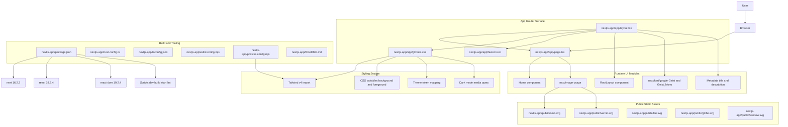

# Nextjs-App Detailed File and Module Map

This chart is specific to the `nextjs-app/` subtree and intentionally separate from root-app migration charts.

## Scope notes

- This map reflects only the current `nextjs-app/` implementation.
- It does not include root-level app routes, legacy pages, importer modules, or root `lib/` modules.
- As porting progresses, this file should be updated to show newly migrated routes and feature modules inside `nextjs-app/`.
