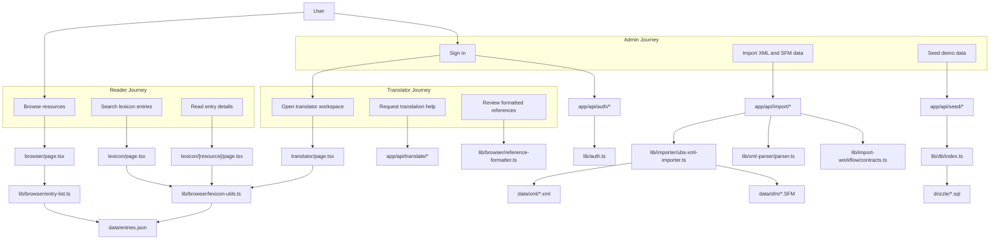

# User Journeys Module Map

```mermaid
flowchart TD
  U[User]

  subgraph J1[Reader Journey]
    R1[Browse resources]
    R2[Search lexicon entries]
    R3[Read entry details]
  end

  subgraph J2[Translator Journey]
    T1[Open translator workspace]
    T2[Request translation help]
    T3[Review formatted references]
  end

  subgraph J3[Admin Journey]
    A1[Sign in]
    A2[Import XML and SFM data]
    A3[Seed demo data]
  end

  U --> R1
  U --> A1
  A1 --> T1

  R1 --> browserPage[browser/page.tsx]
  R2 --> lexiconPage[lexicon/page.tsx]
  R3 --> resourcePage["lexicon/[resource]/page.tsx"]

  T1 --> translatorPage[translator/page.tsx]
  T2 --> translateApi[app/api/translate/*]
  T3 --> refFormatter[lib/browser/reference-formatter.ts]

  A1 --> authRoutes[app/api/auth/*]
  A2 --> importRoutes[app/api/import/*]
  A3 --> seedRoutes[app/api/seed/*]

  browserPage --> entryList[lib/browser/entry-list.ts]
  lexiconPage --> lexiconUtils[lib/browser/lexicon-utils.ts]
  resourcePage --> lexiconUtils
  translatorPage --> lexiconUtils

  importRoutes --> importer[lib/importer/ubs-xml-importer.ts]
  importRoutes --> xmlParser[lib/xml-parser/parser.ts]
  importRoutes --> contracts[lib/import-workflow/contracts.ts]

  authRoutes --> authLib[lib/auth.ts]
  seedRoutes --> dbLib[lib/db/index.ts]

  entryList --> entriesData[data/entries.json]
  lexiconUtils --> entriesData
  importer --> xmlData[data/xml/*.xml]
  importer --> sfmData[data/sfm/*.SFM]
  dbLib --> migrations[drizzle/*.sql]
```
