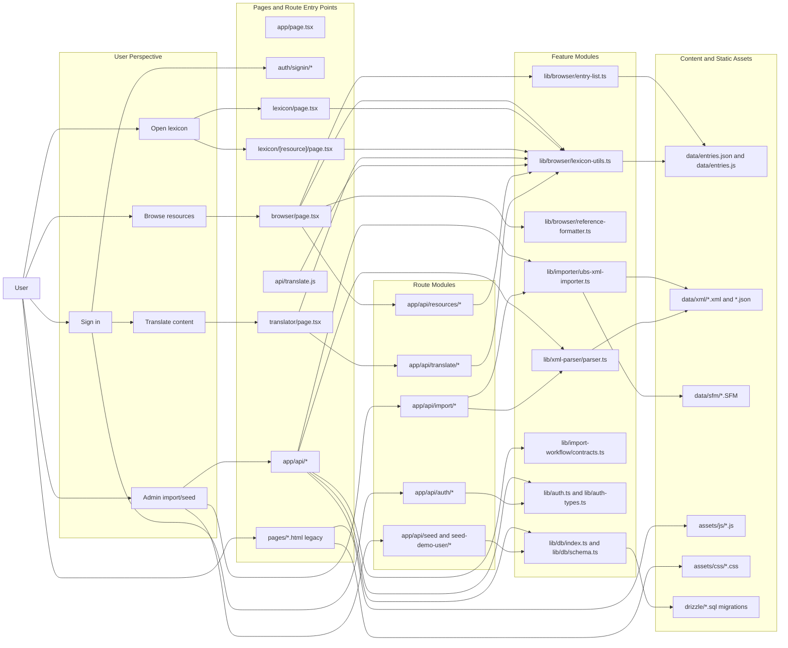

# User Perspective Project Map

```mermaid
flowchart LR
  U[User]

  %% User-visible experiences
  subgraph UX[User Perspective]
    A[Sign in]
    B[Browse resources]
    C[Open lexicon]
    D[Translate content]
    E[Admin import/seed]
  end

  U --> A
  U --> B
  U --> C
  U --> E
  A --> D

  %% Primary entry points
  subgraph EP[Pages and Route Entry Points]
    P0[app/page.tsx]
    P1[auth/signin/*]
    P2[browser/page.tsx]
    P3[lexicon/page.tsx]
    P4["lexicon/[resource]/page.tsx"]
    P5[translator/page.tsx]
    P6[app/api/*]
    P7[api/translate.js]
    P8[pages/*.html legacy]
  end

  A --> P1
  B --> P2
  C --> P3
  C --> P4
  D --> P5
  E --> P6
  U --> P8

  %% Feature modules behind those pages
  subgraph FM[Feature Modules]
    M1[lib/browser/entry-list.ts]
    M2[lib/browser/lexicon-utils.ts]
    M3[lib/browser/reference-formatter.ts]
    M4[lib/importer/ubs-xml-importer.ts]
    M5[lib/xml-parser/parser.ts]
    M6[lib/import-workflow/contracts.ts]
    M7[lib/auth.ts and lib/auth-types.ts]
    M8[lib/db/index.ts and lib/db/schema.ts]
  end

  P2 --> M1
  P2 --> M2
  P2 --> M3
  P3 --> M2
  P4 --> M2
  P5 --> M2
  P6 --> M4
  P6 --> M5
  P6 --> M6
  P6 --> M7
  P6 --> M8
  P7 --> M2

  %% APIs as user-facing service layer
  subgraph API[Route Modules]
    R1[app/api/resources/*]
    R2[app/api/translate/*]
    R3[app/api/import/*]
    R4[app/api/auth/*]
    R5[app/api/seed and seed-demo-user/*]
  end

  P2 --> R1
  P5 --> R2
  E --> R3
  A --> R4
  E --> R5

  R1 --> M2
  R2 --> M2
  R3 --> M4
  R3 --> M5
  R4 --> M7
  R5 --> M8

  %% Data and assets users ultimately interact with
  subgraph DATA[Content and Static Assets]
    D1[data/entries.json and data/entries.js]
    D2[data/xml/*.xml and *.json]
    D3[data/sfm/*.SFM]
    D4[assets/js/*.js]
    D5[assets/css/*.css]
    D6[drizzle/*.sql migrations]
  end

  M1 --> D1
  M2 --> D1
  M4 --> D2
  M5 --> D2
  M4 --> D3
  M8 --> D6
  P8 --> D4
  P8 --> D5
```
